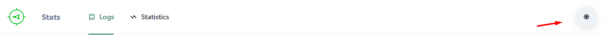
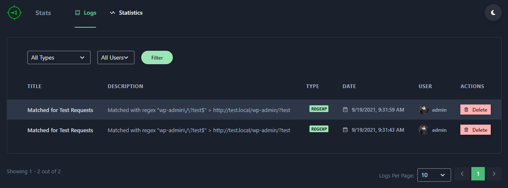
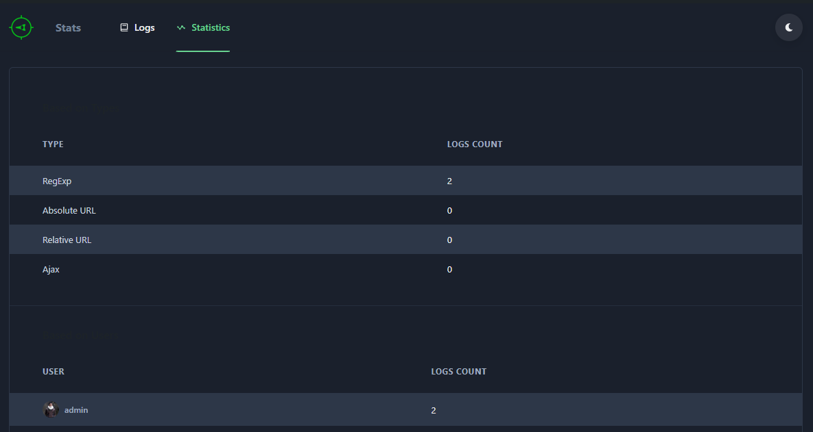
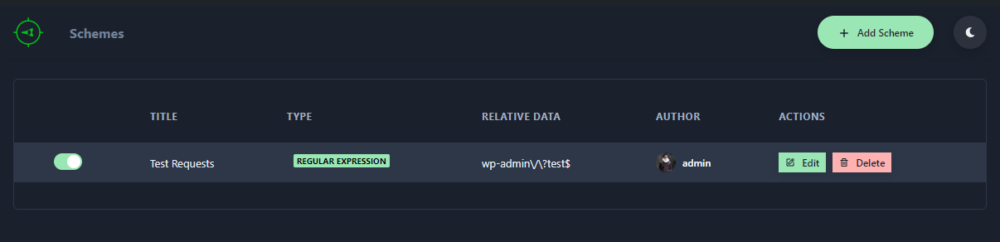
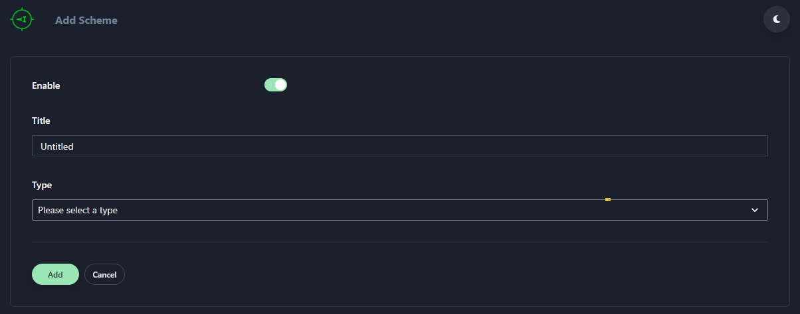
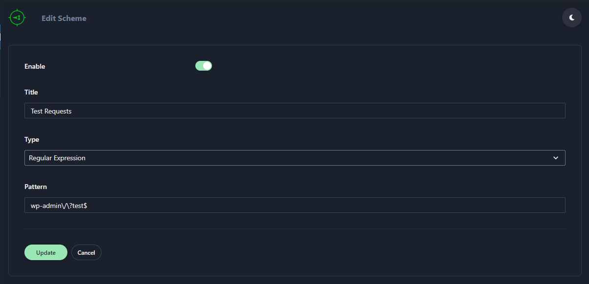
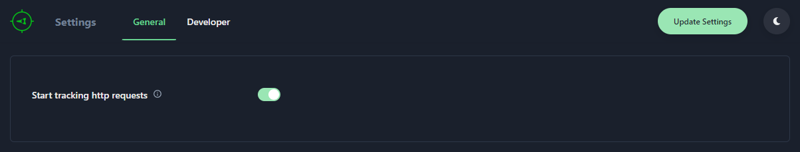
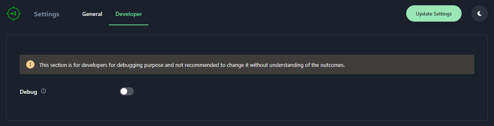

# Dark Mode

There is this button in header of every screen.

You can click this button to enable/disable dark mode.

## Logs & Statistics Screens

## Schemes Management Screens

## Settings Screens

