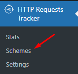
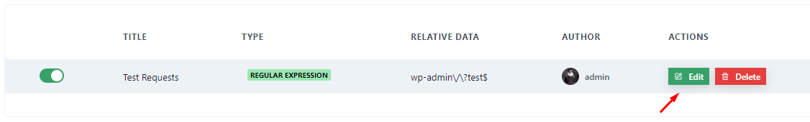
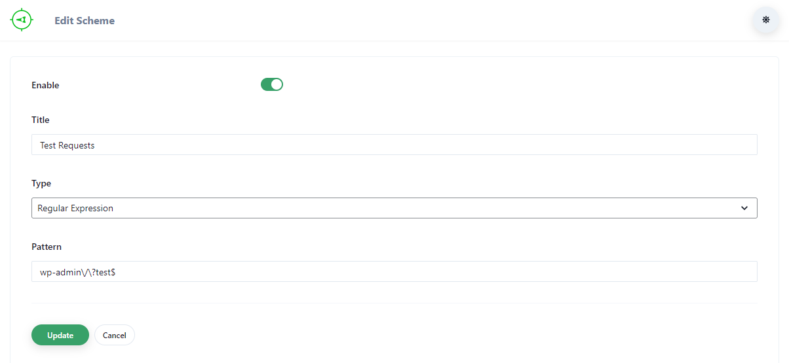

# Edit Schemes

1. Then go to the **Schemes** submenu under *HTTP Requests Tracker* main menu.

2. Click on **Edit** button of the scheme you want to edit

You will see a form as below:

Here you will specify what type of requests should be tracked.

3. Change the title so that you can know easily what type of requests are being tracked by this Scheme later on.
4. For the *type*, there are 4 options:
	1. **Regular Expression** Using this you can match any URLs. For learning how to create Regular Expression please refer to [RegexOne site](https://regexone.com/) or any other online resource you can find. Please enter the expression in the *Pattern* field you will be given after selecting this option.
	2. **Absolute URL** This will track those http requests that have the same exact URL you provide. Please enter the URL in the *URL* field you will be given after selecting this option.
	3. **Relative URL** This will track those http requests that have same relative URL you provide. Relative URL is the part of a URL that comes after domain name. For example, in `http://example.com/post-1`, the part `/post-1` is the Relative url. Please enter the URL in the *URL* field you will be given after selecting this option.
	4. **Predefined** This will give you predefined types of requests. Currenlty there is only *Ajax* requests and you also cannot specify parameters or type of Ajax requests. So, it's not very useful right now.

5. After selecting *type*, click on *Update* button to update the Scheme.
