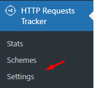
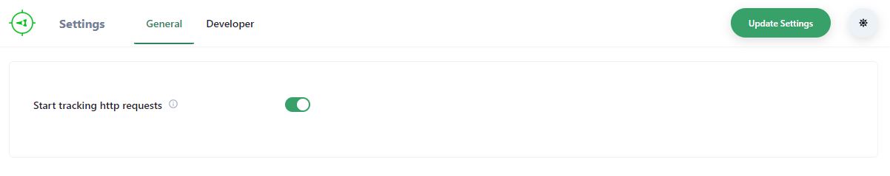
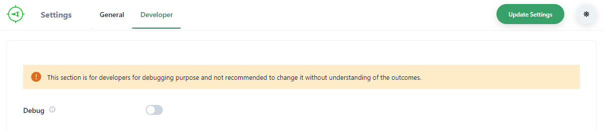

# Settings

Go to the **Settings** submenu under *HTTP Requests Tracker* main menu.

There you will see the settings. There are 2 groups of settings *General* and *Developer*

### General Settings

1. **Start tracking http requests** (*default: `Enabled`*) If disabled this option, then the plugin will stop tracking requests.

### Developer Settings

:::caution

This section is for developers for debugging purpose and not recommended to change it without understanding of the outcomes.

:::

1. **Debug** (*default: `Disabled`*) Currently nothing happens if this option is enabled. But there are plans to activate debugger code after enabling this option in the future. So it's better to keep this option disabled on live sites.

