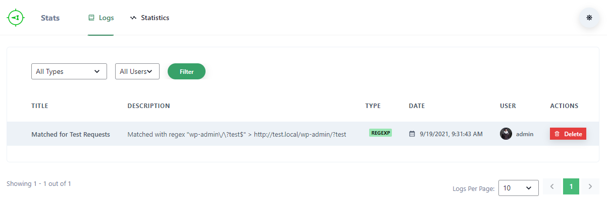

# Getting Started

Here we will learn how to setup everything to start tracking http requests in your site.

## Setting up schemes

First of all we have to specify what kind of requests we want to track. Schemes are used to specify just that.

1. Download, Install and activate this plugin from [WordPress.org](https://wordpress.org/plugins/http-requests-tracker/) or directly from your site's admin panel.

2. Then go to the **Schemes** submenu under *HTTP Requests Tracker* main menu.

3. Click on **Add Scheme**

You will see a form as below:

Here you will specify what type of requests should be tracked.

4. Change the title so that you can know easily what type of requests are being tracked by this Scheme later on.

5. For the *type*, there are 4 options:
	1. **Regular Expression** Using this you can match any URLs. For learning how to create Regular Expression please refer to [RegexOne site](https://regexone.com/) or any other online resource you can find. Please enter the expression in the *Pattern* field you will be given after selecting this option.
	2. **Absolute URL** This will track those http requests that have the same exact URL you provide. Please enter the URL in the *URL* field you will be given after selecting this option.
	3. **Relative URL** This will track those http requests that have same relative URL you provide. Relative URL is the part of a URL that comes after domain name. For example, in `http://example.com/post-1`, the part `/post-1` is the Relative url. Please enter the URL in the *URL* field you will be given after selecting this option.
	4. **Predefined** This will give you predefined types of requests. Currenlty there is only *Ajax* requests and you also cannot specify parameters or type of Ajax requests. So, it's not very useful right now.

6. After selecting *type*, click on *Add* button to add the Scheme.

In this example, we have selected type **Regular Expression** and the expression `wp-admin\/\?test$`. This will track all the requests that have URL ending with `wp-admin/?test`.

## Accessing logs and statistics

Now we will see how we can see logs and statistics of the tracked requests.

### Logs

When tracking http requests the plugin will create logs of each tracked requests with informations like which scheme matched with the request, what URL it matched, date-time of the request, which user made the request etc. To access all the logs

1. Go to the **Stats** submenu under *HTTP Requests Tracker* main menu.

2. Then select the **Logs** tab

There you will see the list of logs

### Statistics

You can also view the statistics of the requests that have been tracked. To access statistics

1. Go to the **Stats** submenu under *HTTP Requests Tracker* main menu.

2. Then select the **Statistics** tab

There you will see the statistics

### Read on

To learn more go to the [docs page](/docs/intro)
